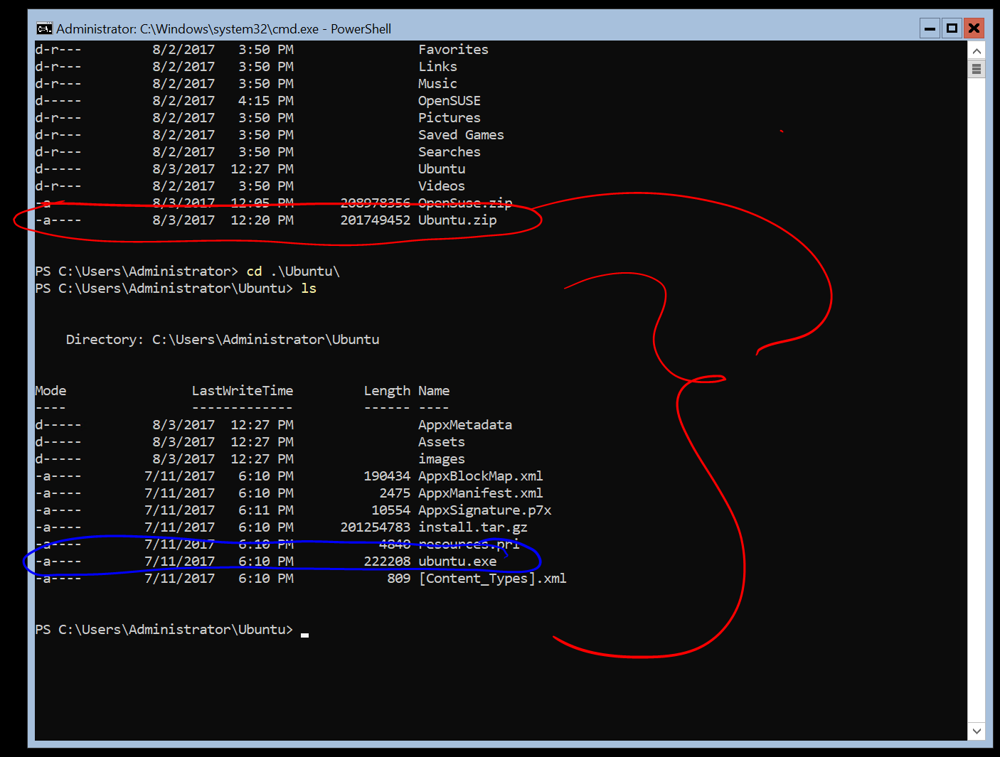
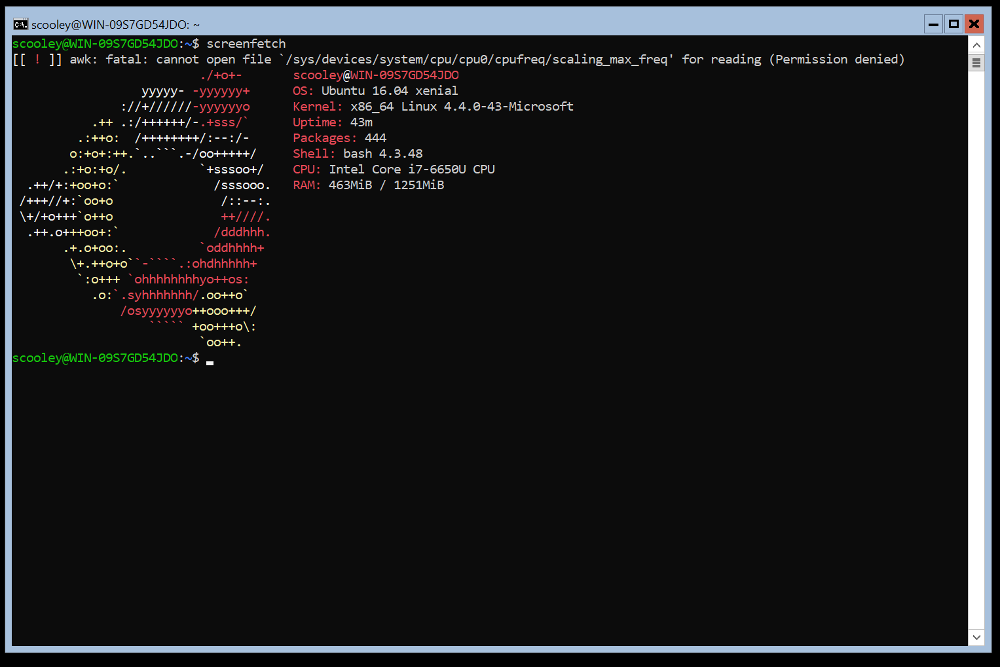

# Windows Server Installation Guide

> [!IMPORTANT]
> Applies to Windows Server 1709 and later.

At //Build2017, Microsoft announced that Windows Subsystem for Linux will be [available on Windows Server](https://blogs.technet.microsoft.com/hybridcloud/2017/05/10/windows-server-for-developers-news-from-microsoft-build-2017/).  These instructions walk through running the Windows Subsystem for Linux on Windows Server 1709 and later.

## Enable the Windows Subsystem for Linux

Enable the "Windows Subsystem for Linux" optional feature and reboot.

1. Open PowerShell as Administrator and run:
    ``` PowerShell
    PowerShell
    Enable-WindowsOptionalFeature -Online -FeatureName Microsoft-Windows-Subsystem-Linux
    ```

2. Restart your computer when prompted.


## Install a Linux distribution

1. Download the appx for your favorite Linux distribution.  
    Here are links directly to the apps available through the store:
    * [Ubuntu](https://aka.ms/wsl-ubuntu-1604)
    * [OpenSUSE](https://aka.ms/wsl-opensuse-42)
    * [SLES](https://aka.ms/wsl-sles-12)

    You can download the distributions to Windows Server with [`Invoke-WebRequest`](https://msdn.microsoft.com/powershell/reference/5.1/microsoft.powershell.utility/invoke-webrequest) cmdlet.  Here's a sample instruction to download Ubuntu.
    
    ``` PowerShell
    Invoke-WebRequest -Uri https://aka.ms/wsl-ubuntu-1604 -OutFile ~/Ubuntu.zip -UseBasicParsing
    ```
    
    > [!TIP]
    > If the download is taking a long time, turn off the progress bar by setting `$ProgressPreference = 'SilentlyContinue'`


3. Unzip the file
    ``` PowerShell
    Expand-Archive ~/Ubuntu.zip ~/Ubuntu
    ```
    
    Make sure your target directory (`~/Ubuntu` in this example) is on your system drive.  Usually this is your C: drive.  
    Example: `C:\Distros\Ubuntu`

    The contents should look like this:
    

5. Run the installer, named `<distro>.exe`  
    For example: `ubuntu.exe`, `fedora.exe`, etc.

    > **Troubleshooting: Installation failed with error 0x8007007e**  
    > This error occurs when your system doesn't support WSL.  Make sure that:
    > * You're running Windows build 16215 or later. [Check your build](troubleshooting.md#check-your-build-number).
    > * The Windows Subsystem for Linux optional component is enabled and the computer has restarted.  [Make sure WSL is enabled](troubleshooting.md#confirm-wsl-is-enabled).

4. Create a UNIX user
    
    The first time you install the Windows Subsystem for Linux, you will be prompted to create a UNIX username and password.  
    
    This UNIX username and password can be different from, and has no relationship to, your Windows username and password. [Learn more about your UNIX account.](user-support.md).

5.  Run distro's preferred update/upgrade.

    ``` BASH
    sudo apt-get update
    sudo apt-get upgrade
    ```

You're done!  Go use your new Linux environment!


